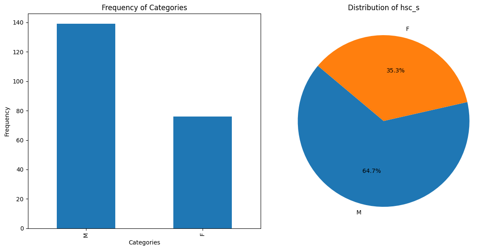
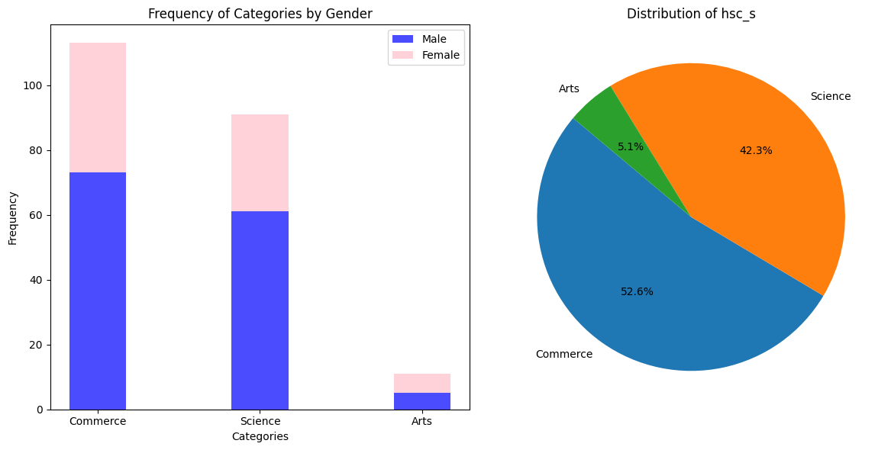

# Placement-Insights-Unveiling-Trends-in-Student-Career-Trajectories
"Analyzing student placement data at XYZ Campus to uncover trends and factors influencing career outcomes. Utilizing descriptive and predictive analytics techniques to provide insights for students, educators, and recruiters.

# Education and Employment Analytics

## Introduction
This project aims to analyze factors influencing educational choices and employment outcomes among students. We explore questions such as whether gender influences choice of educational streams and if salary affects job preferences.

## Stages of Analytics

### Ask
In the "Ask" phase, we formulated key questions to guide our analysis:
- What factors influence categories of education, such as choice of educational streams?
- Does gender play a significant role in selecting educational streams?
- How does salary affect job preferences among students?

### Prepare
In the "Prepare" phase, we acquired a dataset from [Kaggle](https://www.kaggle.com/datasets/benroshan/factors-affecting-campus-placement) to address these questions. Despite its limited size, we assumed the dataset to be sufficiently accurate for our analytical purposes. This dataset formed the foundation for our exploration and analysis of educational and employment trends.

### Process
In the "Process" phase, we thoroughly examined the dataset for cleanliness and consistency. We checked for null values and duplications and found that there were no null values except in the 'salary' column. Although the 'salary' column had a considerable percentage of null values, removing these rows would significantly impact our analysis. Therefore, we decided to retain the rows with null values in the 'salary' column, as the remaining columns were free of nulls. Overall, we concluded that the dataset was mostly cleaned and suitable for analysis.

### Analyze
In the "Analyze" phase, we gained insights from visualizations generated from the dataset. Here are some key insights:

1. **Gender Distribution:** We observed that approximately 65% of the students in the dataset are male, indicating a bias towards male students in the data.

2. **Stream Distribution:** The 'hsc_s' column categorizes students into three streams: Commerce, Science, and Arts. From the bar graph below, we can see that the majority of students have studied Commerce, followed by Science and Arts. Additionally, there is a noticeable gender disparity within each stream, with Commerce having a higher percentage of male students compared to Science and Arts.

3. **Specializations Analysis:** Upon examining the Specializations in our dataset, we observe that students are categorized into two main types: Marketing and Finance, and Marketing and HR. The majority of students have specialized in Marketing and Finance, while others have chosen Marketing and HR. Interestingly, there is a notable gender disparity in the choice of specializations, with a higher percentage of boys specializing in Management and Finance compared to girls.

   
   